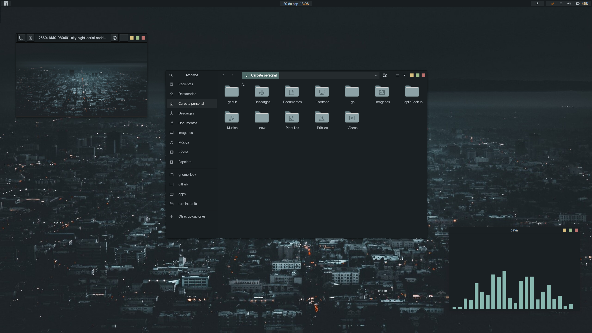

<div align="center">


# Squared GTK theme

</div>




#### Installation

1.- Download from [gnome-look](https://www.gnome-look.org/p/2206255/) 
 
2.- Extract the `.tar` file to the themes directory i.e. `/usr/share/themes/` or `~/.themes/` (create it if necessary).

#### Activating theme

To activate the theme in Gnome, run the following commands in Terminal:

```
gsettings set org.gnome.desktop.interface gtk-theme "Squared"
gsettings set org.gnome.desktop.wm.preferences theme "Squared"
```

or Change via distribution specific tweak-tool.

**For the latest versions of Gnome using Gtk4(libadwaita) some extra steps should be done in order to get it working properly, you could do it in two ways:**

1.- Manual way
  - Copy the `assets` folder to the `~/.config` directory
  - Copy the `gtk-4.0/gtk.css` and `gtk-4.0/gtk-dark.css` files to `~/.config/gtk-4.0/`

2.- Using [this script](https://github.com/odziom91/libadwaita-theme-changer) which will copy the needed folders to the right directories

#### Aditional resources

- [Wallpaper](https://rare-gallery.com/980491-city-night-aerial-aerial-view-lights-traffic-building-.html)

- [Ant Dark folders](https://store.kde.org/p/1640981/)